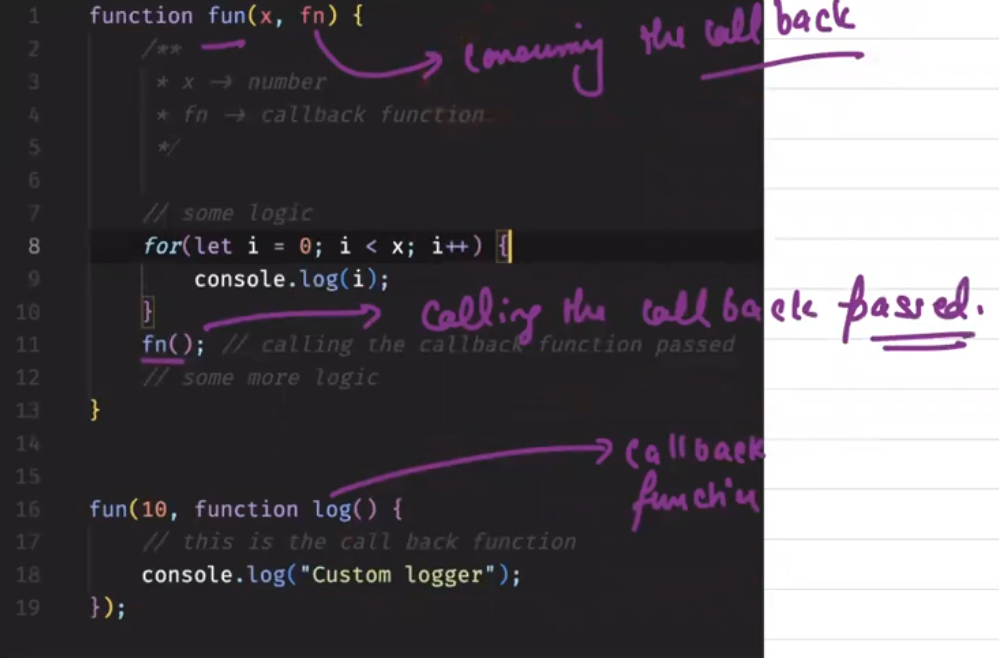

# Callback, Closures and Promises

## what is callback 

1. A function that you pass as an argument to another function.

2. The purpose of a callback is to execute some code after the completion of other functions or processes.

3. JavaScript has no native support for callbacks but we can achieve this using closures, promises and async/await.

4. JavaScript does not have any built-in mechanism that allows us to implement asynchronous programming in JavaScript. 

5. It allows one function to be executed at a later point of time than the completion of other functions or processes. It's called when a function finishes its execution before another function starts executing.

